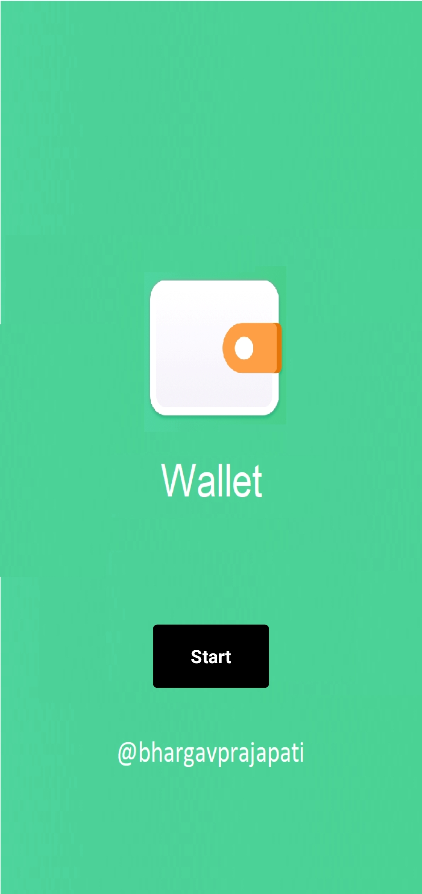
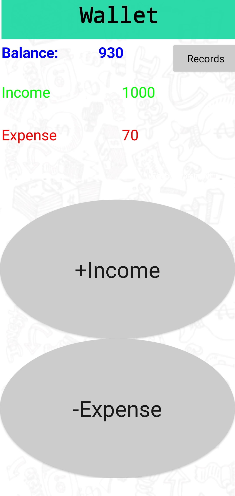
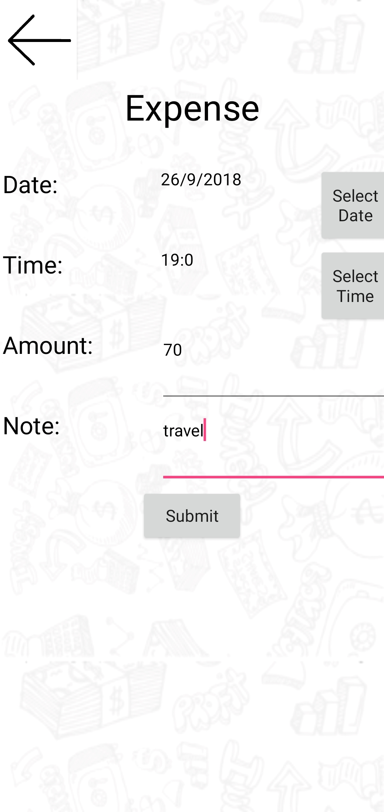
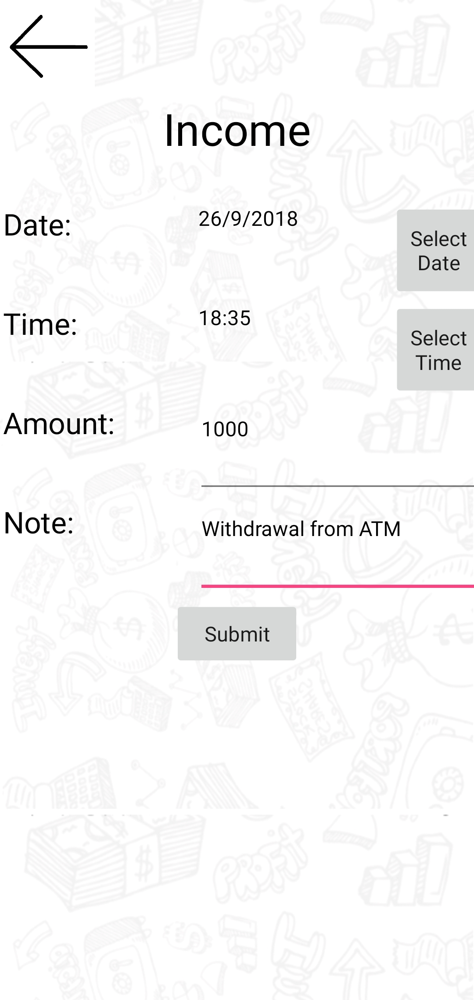
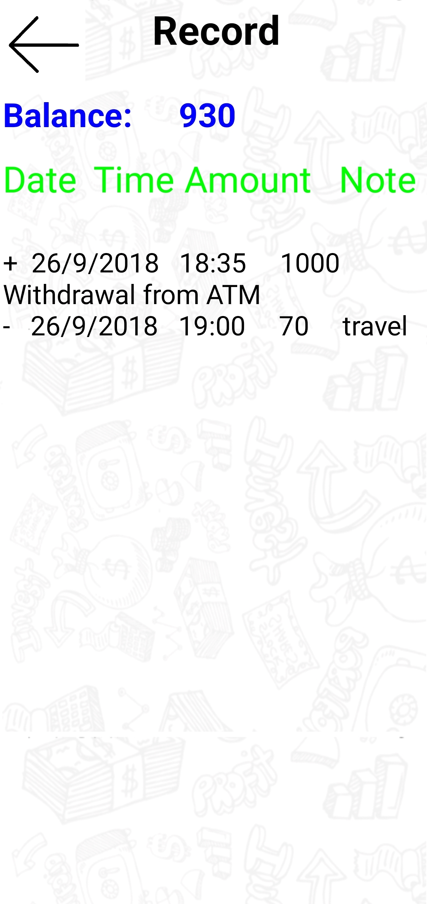

# Wallet Android App using MITAppInventor

This is simple wallet application to track your wallet expenses. 

Here you will have some balance recoded. 

    
    

Now whenever you spend some money you can record your expense with date, time and note(just for your ref, where you spend that money) and That will be deducted from your balance.

    

Wheneven you get some money you can record income with data, time and note(just for your ref, from where you get that money). This will be added to your balance.

    

You can see all past transactions on Records Page

    

